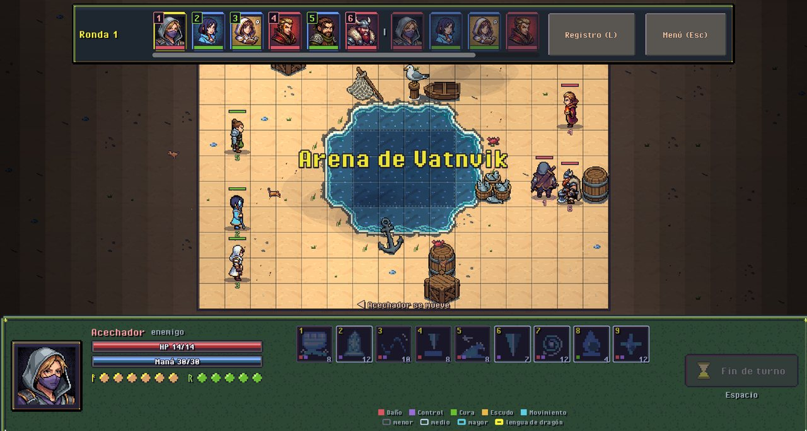
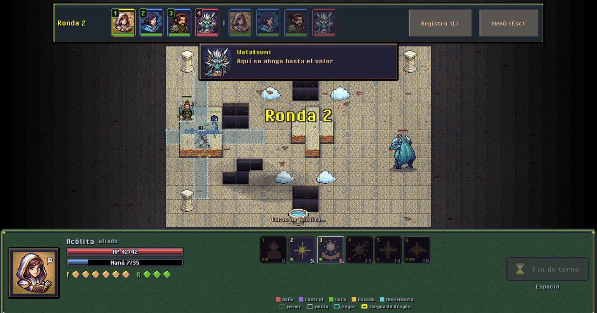
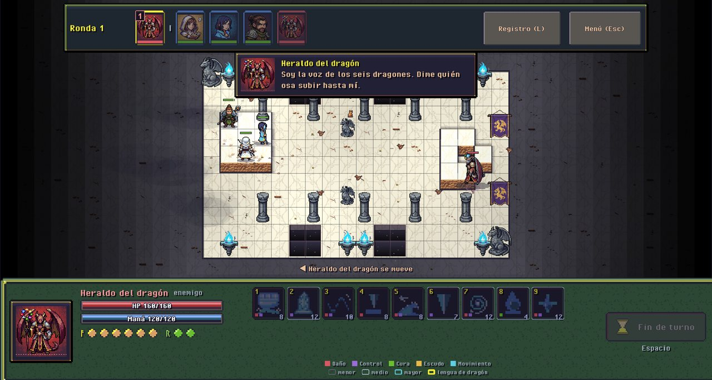
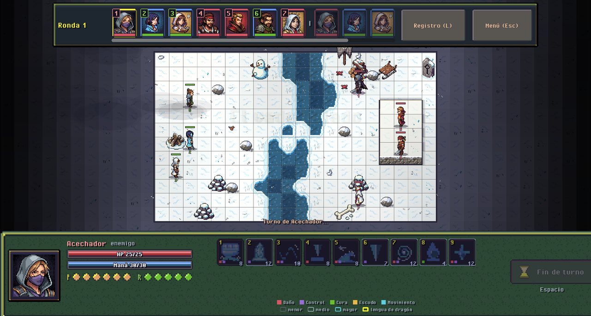

# Archmage

**Naciste sin magia. Un dragón te la dio en sueños. Ahora tienes que aprender a usarla antes de que te use a ti.**

Archmage es un RPG táctico por turnos en pixel art, de fantasía nórdica. Mueves a tu grupo casilla por casilla, eliges cada hechizo y cada paso cuenta: el agua apaga el fuego, la altura te da alcance, un empujón bien puesto manda a un enemigo al vacío.

## Qué vas a hacer

- **Construir a tu archimago.** Eliges tu escuela principal y la secundaria entre seis: agua, fuego, tierra, viento, sombra y luz. Cada escuela tiene doce hechizos y se juega distinta. Engasta gemas para torcer tus hechizos favoritos.
- **Vivir el Acto 1, «El don».** Un sueño con un dragón, un pueblo pesquero, un faro, un viaje y una escuela de magia que no te espera con los brazos abiertos.
- **Subir la Torre del dragón.** Once pisos, una mejora nueva entre piso y piso (hay 25 para elegir) y tres jefes enormes. En la cima te espera el dragón de tu escuela: levanta vuelo, desaparece del tablero y cae en picada donde menos te conviene.
- **Ganar las lenguas de dragón.** Dos palabras de poder por escuela, de esas que cambian una pelea: una se gana en la cima de la Torre y la otra tras diez victorias en la Arena.
- **Pelear en la Arena** con hasta dos aliados contra enemigos de tu nivel, o practicar con muñecos.
- **Retar a tus amigos** en duelos en línea de 1 contra 1, 2 contra 2 o 3 contra 3, con salas por código y un ranking.

## Descargar

Ve a **[Releases](https://github.com/ccramirez20/archmage-builds/releases/latest)** y baja la versión más nueva.

- **Windows:** baja `Archmage-<versión>-windows.zip`, descomprímelo y abre `Archmage.exe`. No se instala nada. Si Windows muestra «Windows protegió tu PC», toca «Más información» → «Ejecutar de todas formas». Sale una sola vez: el juego es nuevo y no tiene una firma de pago.
- **Tablet Android (arm64):** baja el `.apk` en la tablet, ábrelo y acepta «instalar apps desconocidas» la primera vez.

El juego busca versiones nuevas al abrirse y se actualiza desde el título. Tu partida no se toca.

## Controles

- **PC:** clic para moverte y lanzar, clic derecho o Esc para cancelar, teclas 1–0 para los hechizos, Espacio para terminar el turno, rueda para el zoom.
- **Tablet:** arrastra para mover la cámara, pellizca para el zoom; un toque muestra la vista previa y otro confirma.

## ¿Lo estás probando?

Es una versión de prueba y tu opinión la mejora. Si algo se ve raro, un combate se siente injusto o un texto suena mal, manda una captura y una línea de qué estabas haciendo.

---

Archmage es un proyecto independiente en desarrollo. Todos los derechos reservados © 2026.
